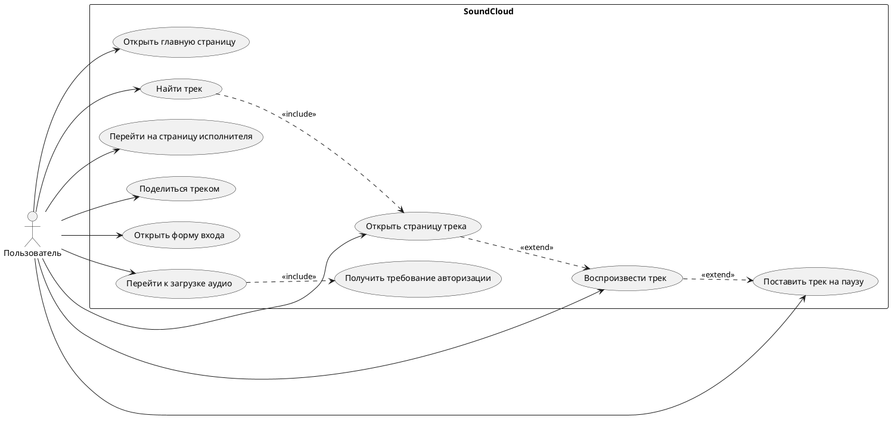

# SoundCloud Functional Tests

Автоматизированные функциональные UI-тесты для сайта [SoundCloud](https://soundcloud.com/) на Java, Selenium WebDriver и JUnit 5.

## Цель проекта

Проект проверяет основные пользовательские сценарии SoundCloud без выполнения необратимых действий:

- открытие главной страницы;
- поиск треков;
- открытие страницы трека;
- воспроизведение и паузу;
- переход на страницу исполнителя;
- открытие формы `Share`;
- переход к `Upload`;
- ограничение доступа без авторизации;
- открытие формы входа;
- попытку входа с некорректными данными.

## Технологии

- Java 17
- Maven
- JUnit 5
- Selenium WebDriver
- Google Chrome
- Mozilla Firefox
- XPath
- Page Object

## Структура проекта

```text
soundcloud-functional-tests
├── pom.xml
├── README.md
├── report.md
└── src
    └── test
        ├── java
        │   └── org
        │       └── example
        │           └── soundcloud
        │               ├── core
        │               ├── pages
        │               └── tests
        └── resources
            └── junit-platform.properties
```

## Запуск тестов

Все тесты:

```bash
mvn test
```

Только Chrome:

```bash
mvn test -Dbrowser=chrome
```

Только Firefox:

```bash
mvn test -Dbrowser=firefox
```

Chrome и Firefox параллельно:

```bash
mvn test -Dbrowser=all
```

Headless-режим:

```bash
mvn test -Dbrowser=chrome -Dheadless=true
```

## Ограничения

- Тесты работают с внешним публичным сайтом, поэтому локаторы могут потребовать обновления при изменении DOM.
- Все элементы ищутся через XPath.
- Используются явные ожидания `WebDriverWait`.
- Реальные аккаунты и загрузка файлов не используются.
- Для запуска нужны установленные браузеры и доступный в `PATH` Maven.

## Отчет

Полный шаблон отчета для лабораторной работы вынесен в [report.md](report.md).

## Use Case Diagram


