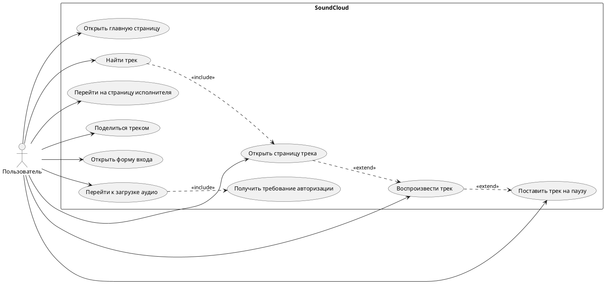

# Отчет по лабораторной работе

## 1. Текст задания

Необходимо разработать проект автоматизированного функционального тестирования веб-приложения SoundCloud. Проект должен проверять основные пользовательские сценарии сайта: открытие главной страницы, поиск треков, открытие страницы трека, воспроизведение и остановку аудиозаписи, переход на страницу исполнителя, открытие формы отправки трека, переход к загрузке аудио и проверку действий, требующих авторизации.

Автоматизация должна быть реализована на Java с использованием Selenium WebDriver и JUnit 5. Тесты должны запускаться в браузерах Google Chrome и Mozilla Firefox. Поиск элементов на странице должен выполняться с помощью XPath. Для работы с динамически загружаемыми элементами необходимо использовать явные ожидания. Код проекта должен быть организован с использованием паттерна Page Object.

## 2. Use Case Diagram



## 3. Checklist тестового покрытия

| № | Проверка | Ожидаемый результат |
| --- | --- | --- |
| 1 | Открыть главную страницу SoundCloud | Главная страница загружается |
| 2 | Найти поле поиска | Поле поиска отображается |
| 3 | Ввести запрос в поиск | Текст вводится в поле |
| 4 | Отправить поисковый запрос | Открывается страница результатов |
| 5 | Проверить наличие результатов поиска | На странице есть найденные треки |
| 6 | Открыть первый найденный трек | Открывается страница трека |
| 7 | Нажать кнопку Play | Плеер меняет состояние |
| 8 | Нажать кнопку Pause | Воспроизведение останавливается |
| 9 | Перейти на страницу исполнителя | Открывается профиль автора |
| 10 | Нажать кнопку Share | Открывается окно отправки ссылки |
| 11 | Перейти на страницу Upload | Открывается страница загрузки |
| 12 | Проверить Upload без авторизации | Сайт требует авторизацию |
| 13 | Открыть форму входа | Форма входа отображается |
| 14 | Ввести некорректные данные входа | Данные вводятся в форму |
| 15 | Отправить форму входа | Вход не выполняется |

## 4. Набор тестовых сценариев

| Тест | Описание сценария | Класс |
| --- | --- | --- |
| TC-1 | Открытие главной страницы | `HomePageTest#shouldOpenHomePage` |
| TC-2 | Проверка видимости поля поиска | `HomePageTest#shouldDisplaySearchInput` |
| TC-3 | Открытие страницы результатов поиска | `SearchTest#shouldOpenSearchResultsPage` |
| TC-4 | Проверка наличия результатов поиска | `SearchTest#shouldDisplaySearchResults` |
| TC-5 | Открытие первого трека из результатов | `SearchTest#shouldOpenFirstTrackFromResults` |
| TC-6 | Запуск воспроизведения трека | `PlayerTest#shouldStartPlayback` |
| TC-7 | Постановка трека на паузу | `PlayerTest#shouldPausePlayback` |
| TC-8 | Переход на страницу исполнителя | `PlayerTest#shouldOpenArtistPage` |
| TC-9 | Открытие формы Share | `PlayerTest#shouldOpenShareDialog` |
| TC-10 | Переход к Upload | `UploadTest#shouldOpenUploadPage` |
| TC-11 | Проверка требования авторизации для Upload | `UploadTest#shouldRequireAuthorizationForUpload` |
| TC-12 | Открытие формы входа | `AuthTest#shouldOpenLoginForm` |
| TC-13 | Попытка входа с некорректными данными | `AuthTest#shouldRejectInvalidCredentials` |

## 5. Структура проекта

```text
soundcloud-functional-tests
├── pom.xml
├── README.md
├── report.md
└── src
    └── test
        ├── java
        │   └── org
        │       └── example
        │           └── soundcloud
        │               ├── core
        │               │   ├── BrowserType.java
        │               │   ├── DriverFactory.java
        │               │   └── TestData.java
        │               ├── pages
        │               │   ├── BasePage.java
        │               │   ├── HomePage.java
        │               │   ├── SearchPage.java
        │               │   ├── TrackPage.java
        │               │   ├── ArtistPage.java
        │               │   ├── UploadPage.java
        │               │   └── LoginPage.java
        │               └── tests
        │                   ├── BaseTest.java
        │                   ├── HomePageTest.java
        │                   ├── SearchTest.java
        │                   ├── PlayerTest.java
        │                   ├── UploadTest.java
        │                   └── AuthTest.java
        └── resources
            └── junit-platform.properties
```

## 6. Используемые технологии

| Технология | Назначение |
| --- | --- |
| Java 17 | Язык программирования |
| Maven | Сборка проекта и запуск тестов |
| JUnit 5 | Фреймворк модульного и параметризованного запуска тестов |
| Selenium WebDriver | UI-автоматизация браузера |
| Chrome / Firefox | Браузеры для проверки |
| XPath | Поиск элементов в DOM |
| Page Object | Организация тестового кода |

## 7. Результаты выполнения тестов

На момент подготовки этого отчета кодовая база и структура проекта приведены в соответствие с требованиями лабораторной работы. Фактические результаты браузерного прогона должны быть внесены после запуска на машине с установленными Maven, Chrome и Firefox.

Пример таблицы для заполнения после выполнения:

| Тестовый сценарий | Chrome | Firefox | Результат |
| --- | --- | --- | --- |
| Открытие главной страницы | pending | pending | ожидает запуска |
| Поиск треков | pending | pending | ожидает запуска |
| Открытие трека | pending | pending | ожидает запуска |
| Воспроизведение трека | pending | pending | ожидает запуска |
| Пауза трека | pending | pending | ожидает запуска |
| Переход на страницу автора | pending | pending | ожидает запуска |
| Открытие Share | pending | pending | ожидает запуска |
| Переход к Upload | pending | pending | ожидает запуска |
| Открытие формы входа | pending | pending | ожидает запуска |
| Вход с некорректными данными | pending | pending | ожидает запуска |

## 8. Вывод

Разработан Maven-проект автоматизированного функционального тестирования SoundCloud с использованием Selenium WebDriver, JUnit 5 и паттерна Page Object. В проекте реализованы тесты для основных пользовательских сценариев, включая поиск треков, работу со страницей трека, проверку ограничений без авторизации и форму входа. Все основные локаторы оформлены через XPath, а работа с динамическими элементами построена на явных ожиданиях.
